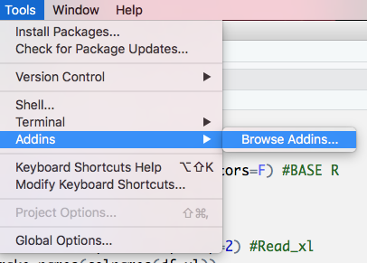

## Introduction to R for Journalists: How to Find Great Stories in Data

### Here are my course notes for Andrew Tran's five week course on R for journalists. The course started on July 23, 2018 and will end on August 26, 2018. [Course link](https://journalismcourses.org/course/view.php?id=9)

---

# Week 1
During the first week we covered the basics of the R language. I know most of these commands which I documented in my other R github repo here: [RstatsInTheBatcave](https://github.com/megomars/RStatisticsInTheBatcave) and here: [TidyverseInTheBatcave](https://github.com/megomars/TidyverseInTheBatcave).

This is what we did in week 1:
- A tour of the RStudio IDE - *complete*
- Syntax for coding in R - *complete*
  - Vectors
  - Matrices
  - Data frames
  - Lists
  - Functions
- Creating R scripts - *complete*
- Importing packages - *complete*
- Good habits for workflow and documentation habits *complete*
- How to import data like CSVs, Excel spreadsheets, XML *complete*
  - csv - here we can either use the Readr package or Base R.
  - excel - here we used the read_excel package.
  - delimited data - here we use base R and read.table or read_delim
  - JSON data - here we used the jsonlite package
  - SPSS data - here we used base R's read.spss()
  - Copying and pasting data

Quick recap of the main commands:
```{r}
#set working directory
setwd("~/projects/learn-r-journalism")

#run the entire saved script.R
source("script.R")

#Installing packages
install.packages("readr")
library(readr)

#Importing Data

  #CSV
  mydata <- read_csv("dataset.csv", stringsAsFactors=F) #BASE R
  mydata_2 <- read_csv("dataset.csv") #Readr

  #Excel
  mydata <- read_xl("dataset.csv", sheet=1, skip=2) #Read_xl
  colnames(df_xl) <- make.names(colnames(df_xl))
  
  #Delimited
  df1 <- read.table("data/Employee_Payroll_Pipe.txt", header=TRUE, sep="|") #BASE R
  df1 <- read_delim("data/Employee_Payroll_Pipe.txt", delim="|") #Readr
  
  #JSON
  stations <- fromJSON(MetaverseStationData.json)
  
  #SPSS
  data_labels <- read.spss("data/SHR76_16.sav", to.data.frame=TRUE)
  
  #Copying and pasting data
  install.packages("tibble")
  install.packages("datapasta")
  library(tibble)
  library(datapasta)
  
  df1<-tibble::tribble(
      ~Week.Ending,       ~Gross, ~Perc.Gross.Pot., ~Attendance, ~Perc.Capacity, ~Perc.Previews, ~Perc.Perf.,
    "May 27, 2018", "$2,987,818",        "109%",       10734,      "102%",          0L,       8L,
    "May 20, 2018", "$3,120,832",        "108%",       10754,      "102%",          0L,       8L,
    "May 13, 2018", "$2,816,606",        "107%",       10738,      "102%",          0L,       8L,
     "May 6, 2018", "$3,101,303",        "107%",       10757,      "102%",          0L,       8L,
    "Apr 29, 2018", "$2,823,279",        "107%",       10736,      "102%",          0L,       8L,
    "Apr 22, 2018", "$3,081,677",        "106%",       10756,      "102%",          0L,       8L,
    "Apr 15, 2018", "$3,139,968",        "108%",       10758,      "102%",          0L,       8L
    )
  
  df2<- data.frame(stringsAsFactors=FALSE,
      Week.Ending = c("May 27, 2018", "May 20, 2018", "May 13, 2018", "May 6,
                      2018", "Apr 29, 2018", "Apr 22, 2018", "Apr 15, 2018"),
            Gross = c("$2,987,818", "$3,120,832", "$2,816,606", "$3,101,303",
                      "$2,823,279", "$3,081,677", "$3,139,968"),
     perc.Gross.Pot. = c("109%", "108%", "107%", "107%", "107%", "106%", "108%"),
       Attendance = c(10734, 10754, 10738, 10757, 10736, 10756, 10758),
       perc.Capacity = c("102%", "102%", "102%", "102%", "102%", "102%", "102%"),
       perc.Previews = c(0L, 0L, 0L, 0L, 0L, 0L, 0L),
          perc.Perf. = c(8L, 8L, 8L, 8L, 8L, 8L, 8L)
  )
  View(df1)
  str(df1)
  View(df2)
  str(df2)
  
  #Bulk CSV creation
  install.packages("devtools")
  devtools::install_github(("andrewbtran/muckrakr"))
  
  library(muckrakr)
  #preprocessing
  allplanes <- bulk_csv("csvs")
  plane <- allplanes[,1:4]
  write_csv(plane,"planes.csv")
  #Just export it directly
  allplanes <- bulk_csv("csvs", export="allplanes.csv")
  View(allplanes)
```



---

# Week 2
- Wrangling data with the dplyr and tidyr packages.
Dplyr is used to explore and transform data-frames.
The basic verbs are:

F-SAMS-Gb
```{r}
filter() 
select()
arrange()
mutate()
summarize()
group_by()
```


---

# Week 3
- Visualising data with ggplot2.
